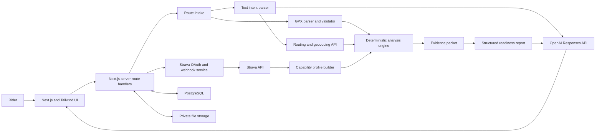

# Expedition OS Product and Technical Plan

Status: Working plan v0.2

Date: 11 August 2026

Initial audience: one rider using their own Strava history

Primary platform: responsive web application

## Current implementation status

The first vertical slice now supports three equal route sources: the bundled GPX, a route built manually from map clicks or explicit place searches, and a plain-language Copilot plan. All three become the same normalized route dataset and can use the dashboard map, elevation profile, OpenStreetMap place layers, itinerary tools, grounded OpenAI analysis and GPX export.

Implemented locally:

- manual start, finish and via anchors on a MapLibre map;
- server-side South African place search through Nominatim with caching and conservative rate limiting;
- bicycle routing through Valhalla, split into stages for long multi-day trips;
- sampled route elevation through Open-Meteo;
- GPT-5.6 Luna typed adventure blueprints with geocoded towns and overnight areas;
- a pre-route OpenStreetMap discovery map with clustered, independently toggleable lodging, food, fuel, grocery, shopping, water, service and highlight layers;
- Default, worldwide topographic, terrain, satellite and globe basemap modes with Google Map Tiles activation and OpenTopoMap fallback;
- staged place discovery that renders a fast popular-place result set before broader community coverage completes;
- mapped place details including contributor-supplied hours, contact details, websites and clearly labelled lodging classifications;
- on-demand Google Places matching for selected named places with attributed ratings, current open status, weekly hours and official links;
- draggable and reorderable anchors, road/bike/hill preferences and visual multi-day route segments;
- real OpenStreetMap lodging, food, fuel, grocery, water and service candidates around the final route;
- private browser-local route library for up to 12 adventures;
- shared route analysis and GPX export for uploaded, manual and Copilot routes.

## 1. Executive decision

Yes, Expedition OS can support both of these inputs:

1. Upload an existing GPX route.
2. Describe an adventure in ordinary language, such as "I want to cycle up Lady's Slipper mountain" or "I want to bike-pack to Cape Town and back."

Both inputs should end in the same route-analysis pipeline. The application will calculate the route facts, compare them with the rider's demonstrated history, and return an evidence-backed assessment of:

- whether a connected route can be found;
- whether public route data indicates that cycling is allowed;
- distance, ascent, descent, gradient and likely duration;
- single-day or multi-day workload;
- similarity to previously completed rides;
- fitness and experience gaps;
- weather, daylight, water and resupply risks when those data sources are enabled;
- unknowns that still require local knowledge or manual confirmation.

The result must not be a simple AI opinion. It should be a calculated report with a plain-language explanation, a confidence level, the evidence used, and a list of unresolved risks.

## 2. Recommended UI architecture

Choose **Next.js + Tailwind + TypeScript** from the supplied architecture options.

Next.js is still React, but it also provides server-side route handlers. Expedition OS needs those server boundaries for Strava OAuth, refresh tokens, webhooks, OpenAI calls, mapping-provider keys and GPX processing. A browser-only React application would need a separate backend before it could handle these responsibilities safely.

Tailwind is a good fit for the product, but the finished interface should not look like a generic admin dashboard. TailAdmin can provide layout and form patterns while the product develops its own map-led expedition identity.

Recommended foundation:

| Layer | Recommended choice | Reason |
|---|---|---|
| Web application | Next.js App Router with TypeScript | React UI and server endpoints in one project |
| Styling | Tailwind CSS | Fast, consistent responsive UI work |
| Map rendering | MapLibre GL JS | Interactive route maps without coupling the UI to one routing provider |
| Route calculation | Valhalla behind an internal adapter | Bicycle costing, multi-leg routing and encoded route geometry based on OpenStreetMap |
| Elevation | Open-Meteo Elevation API | Sampled Copernicus DEM elevation without exposing a client key |
| Place search | Nominatim and Overpass | Explicit geocoding plus route-aware OpenStreetMap services and lodging |
| Athlete data | Strava REST API and webhooks | Predictable product integration, OAuth and incremental activity updates |
| AI | OpenAI Responses API with Structured Outputs | Converts text into typed intent and turns computed evidence into a consistent report |
| Persistence | PostgreSQL-compatible database | Durable normalized route, activity and analysis records |
| File storage | Private object storage | Optional retention of original GPX files and derived artefacts |
| Deployment | A Node.js-capable host | Required for route handlers, OAuth callbacks and webhook processing |

MCP can help during development, but it should not be the application's production connection to Strava. The Strava API is the stable product boundary.

## 3. The product promise

> Describe or upload an adventure and learn whether the route is viable, whether you appear ready for it, and what must change before you attempt it.

Expedition OS answers two different questions and keeps them separate:

### Route viability

Can a route be built and what external problems could prevent it?

- connected roads or trails;
- cycling access and known restrictions;
- surface and technical uncertainty;
- total distance and climbing;
- daylight and seasonal conditions;
- water, resupply, accommodation and bailout options;
- border, ferry or permit requirements where relevant.

### Personal readiness

Does the rider's history contain enough evidence that this workload is realistic?

- longest recent ride;
- highest ascent in a day;
- longest time moving;
- climbing density, measured as ascent per kilometre;
- pace on comparable terrain;
- performance after four, six, eight and ten hours;
- consecutive-day load;
- recent training volume and recency;
- activity type and bike relevance;
- heart-rate or power fade when those streams exist.

The application should never turn these into a guarantee. "Possible" means that the available evidence supports the plan within stated assumptions. It does not mean safe, legal or medically advisable.

## 4. Primary user journeys

### 4.1 Upload a GPX route

1. The rider selects or drops a `.gpx` file.
2. The server validates file type and size, then parses tracks, routes and waypoints.
3. The application displays the geometry on a map before analysis.
4. The rider confirms activity type, intended days, loaded-bike estimate and preferred daily riding hours.
5. The analysis engine calculates route metrics and enriches missing elevation or surface data.
6. The readiness engine compares the route with Strava history.
7. Expedition OS returns the report and links each conclusion to its evidence.

### 4.2 Describe a route in plain language

1. The rider enters an idea.
2. The OpenAI API converts the text into a typed `AdventureIntent`, not a finished route.
3. Expedition OS resolves places through geocoding and identifies missing facts.
4. The rider answers only the material ambiguities, such as starting point, one-way versus return, bike type, available days or acceptable road use.
5. The routing service produces one or more candidate routes.
6. The rider reviews and edits the route on a map.
7. The confirmed candidate enters the same analysis pipeline as an uploaded GPX file.

For "cycle up Lady's Slipper," the app may know the place but still lack reliable access, gate, trail-condition or technical-riding information. It must say so and request confirmation rather than inventing certainty.

For "bike-pack to Cape Town and back," the app must first resolve the starting point, direction, number of days, road-versus-gravel preference and whether the return route should differ. The distance alone is not enough to form a useful plan.

## 5. System architecture

### Architectural rule

Calculations own the facts. The model owns language interpretation and explanation.

The model may:

- extract a structured adventure brief from natural language;
- explain comparisons and trade-offs;
- identify which missing fact matters next;
- produce a readable report from a validated evidence packet.

The model must not:

- calculate the authoritative GPX distance or ascent;
- invent roads, trails, water points or access rights;
- treat missing terrain data as confirmed easy terrain;
- infer medical fitness or guarantee safety;
- cite an activity that the analysis engine did not include in the evidence packet.

## 6. Route-analysis pipeline

### Stage A: Intake and validation

- Accept GPX 1.0 and 1.1 XML.
- Reject malformed XML, executable content and files above the configured limit.
- Parse tracks, route points, segments and waypoints.
- Detect missing or implausible coordinates, timestamps and elevation.
- Preserve the original geometry and create a simplified display geometry.

### Stage B: Deterministic route facts

- total and segment distance;
- cumulative ascent and descent;
- elevation range;
- grade distribution and steepest sustained sections;
- climb count and climb length;
- route loop or point-to-point classification;
- estimated moving time across multiple pace models;
- required daily distance and ascent for multi-day trips;
- available surface and road-class estimates;
- route discontinuities and questionable jumps.

### Stage C: Capability profile

The initial Strava import should normalize activity summaries and selected streams into comparable facts. The profile should prefer recent, relevant evidence while retaining all-time reference efforts.

Suggested derived metrics:

- 30, 90 and 365-day distance and ascent;
- longest relevant activity in each period;
- highest single-day ascent;
- longest back-to-back and three-day blocks;
- median speed by climbing-density band;
- late-activity speed, heart-rate and power drift;
- comparable rides ranked by distance, ascent, duration and sport type;
- data coverage indicators for heart rate, power, cadence and elevation.

### Stage D: Readiness calculation

The first version should be rule-based and inspectable. Each factor produces a score, confidence and evidence list.

| Factor | Example evidence |
|---|---|
| Distance readiness | Proposed daily distance compared with longest recent and all-time relevant rides |
| Climbing readiness | Daily ascent and climbing density compared with demonstrated efforts |
| Duration readiness | Estimated moving time compared with longest sustained activities |
| Consecutive-day readiness | Planned multi-day load compared with completed training blocks |
| Terrain readiness | Surface and sport-type match, with unknown terrain penalizing confidence |
| Recency | Age of the strongest comparable activities |
| Data quality | Coverage and consistency of GPX, elevation and Strava streams |

The overall percentage must not hide weak factors. A critical blocker, such as a disconnected route or no evidence of consecutive-day riding, remains visible even when the weighted score is otherwise high.

### Stage E: Evidence packet and report

The analysis engine sends the model a compact JSON object containing only validated results:

- route summary and daily plan;
- factor scores and confidence;
- comparable activity identifiers and metrics;
- blockers, warnings and unknowns;
- assumptions supplied by the rider;
- suggested adjustments already calculated by the engine.

The OpenAI response should conform to a schema with sections such as `verdict`, `confidence`, `strengths`, `gaps`, `unknowns`, `comparableActivities`, `recommendedChanges` and `nextQuestions`.

## 7. Report design

Every report should contain five visible layers:

1. **Verdict:** viable, viable with changes, insufficient information, or not currently viable.
2. **Readiness:** physical preparation compared with demonstrated history.
3. **Confidence:** high, moderate or low, with the reason for that confidence.
4. **Evidence:** the route facts and past activities used in each conclusion.
5. **Unknowns and actions:** what the app cannot prove and what the rider should confirm.

Example shape:

| Category | Assessment | Confidence | Why |
|---|---:|---|---|
| Distance readiness | 82% | High | Two recent rides are within 15% of the planned daily distance |
| Climbing readiness | 61% | Moderate | Proposed climbing density is higher than any ride in the last 90 days |
| Consecutive-day readiness | 44% | High | No comparable two-day block exists in the imported history |
| Surface and access | Unknown | Low | Public map data does not confirm the full trail or access status |

## 8. Data model outline

The schema should be multi-user safe even while the initial product supports one athlete.

| Entity | Purpose |
|---|---|
| `users` | Application identity and preferences |
| `strava_connections` | Athlete ID, scopes, encrypted token material and sync state |
| `activities` | Normalized Strava activity summaries |
| `activity_streams` | Compressed or object-stored time-series data and coverage metadata |
| `capability_snapshots` | Versioned derived capability metrics |
| `routes` | Uploaded, imported or generated route records |
| `route_versions` | Geometry and assumptions for each revision |
| `route_analyses` | Versioned deterministic results and report output |
| `analysis_evidence` | Links between report conclusions, activities and route facts |
| `adventure_plans` | Day splits, dates, equipment assumptions and user decisions |
| `chat_threads` | Conversation state scoped to a route or plan |

Every user-owned record must carry a user identifier. Strava access and refresh tokens must be encrypted at rest and must never be exposed to browser JavaScript.

## 9. MVP scope

### Included

- manual map-based route creation and explicit place search;
- natural-language route generation and editable route anchors;
- bicycle route calculation and elevation enrichment;
- OpenStreetMap water, shops, accommodation and resupply discovery;
- browser-local saved route library for the current private prototype;
- personal sign-in and one connected Strava account;
- Strava OAuth, historical activity backfill and webhook updates;
- capability profile for rides and mountain-bike rides;
- GPX upload, validation and map preview;
- route distance, elevation, climbing and estimated duration;
- single-day and multi-day readiness comparison;
- comparable-activity evidence;
- structured AI explanation and follow-up questions;
- saved routes and reports;
- responsive desktop and tablet interface.

### Deferred until the core result is trusted or the required service is configured

- weather and daylight forecasts;
- live navigation or offline maps;
- automatic rerouting in the field;
- medical, injury or recovery advice;
- emergency tracking or SOS features;
- team and social features;
- adventure-race simulation;
- equipment maintenance predictions.

Natural-language and manual route generation are now part of the prototype. Production launch still requires managed or self-hosted routing/geocoding capacity, durable authenticated persistence, and stronger route-access and surface validation.

## 10. Delivery plan and acceptance criteria

### Milestone 0: Product shell and contracts

Build the Next.js and Tailwind shell, map screen, shared schemas and provider interfaces.

Acceptance criteria:

- the application has Dashboard, Plan Adventure, Route Report and Settings routes;
- secret environment variables are server-only;
- route and report schemas validate at runtime;
- the map can render a known test line without an external account connection.

### Milestone 1: Strava connection and history

Implement OAuth, token refresh, paginated backfill, activity normalization and webhook handling.

Acceptance criteria:

- the rider can connect and disconnect Strava;
- the app imports the expected activity count without duplicates;
- private activities respect the granted scope;
- token refresh works without exposing tokens to the browser;
- create, update, delete and deauthorization webhook cases are handled idempotently;
- rate-limit headers are recorded and backfill pauses safely.

### Milestone 2: GPX route facts

Implement upload, parsing, elevation calculations, map preview and validation warnings.

Acceptance criteria:

- representative GPX 1.0 and 1.1 fixtures parse correctly;
- known fixture distances and ascent values fall within defined tolerances;
- malformed and oversized files fail with useful messages;
- a route can be reviewed before it is saved;
- missing elevation is clearly distinguished from zero elevation.

### Milestone 3: Capability and readiness engine

Build comparable-activity selection, derived metrics, factor scoring and confidence logic.

Acceptance criteria:

- every score can be traced to stored metrics and versioned rules;
- sparse history lowers confidence instead of inventing readiness;
- an extreme factor remains visible and cannot be averaged away;
- regression fixtures cover short rides, long rides, high climbing and multi-day plans;
- the same inputs always produce the same deterministic result.

### Milestone 4: Evidence-backed AI report

Connect the OpenAI Responses API after the deterministic output is stable.

Acceptance criteria:

- the report conforms to the required JSON schema;
- every named activity exists in the supplied evidence packet;
- the report distinguishes facts, estimates and unknowns;
- the app still displays the deterministic report if the AI request fails;
- prompt and output versions are stored for later evaluation;
- a small evaluation set catches fabricated evidence and unsafe certainty.

### Milestone 5: Plain-language route builder

Add intent extraction, geocoding, ambiguity resolution and cycling-route candidates.

Acceptance criteria:

- a prompt becomes a typed intent before any route is requested;
- ambiguous starting points and destinations require confirmation;
- the user can compare, adjust and reject candidates on the map;
- the user can inspect and toggle useful places before choosing the route;
- route anchors can be dragged, reordered and rebuilt with cycling preferences;
- multi-day routes show colour-coded stages with per-day distance, ascent and moving-time estimates;
- generated candidates use the same analysis engine as GPX routes;
- missing access or surface data appears as an unknown, never as a positive assumption.

### Milestone 6: Trip logistics

Add weather, daylight, water, resupply, accommodation and bailout enrichment.

Acceptance criteria:

- each external fact records its provider and retrieval time;
- contributor-supplied opening hours are labelled as listed rather than guaranteed live status;
- user ratings and booking availability are absent unless a licensed enrichment provider is configured;
- forecast data is not presented as historical certainty;
- stale or unavailable provider data degrades cleanly;
- users can correct or add local knowledge without changing the underlying route facts.

## 11. Testing strategy

- unit tests for GPX geometry, elevation gain, grade bands and route splitting;
- contract tests for Strava, routing and OpenAI response schemas;
- deterministic readiness fixtures with expected factors and confidence;
- webhook idempotency and token-refresh integration tests;
- end-to-end tests for connect, upload, analyze, save and reopen flows;
- map screenshot checks at desktop and tablet sizes;
- AI evaluation cases for unsupported certainty, fabricated activities and missing-data honesty;
- manual field validation against several known completed rides and proposed routes.

The most important validation is not whether the report sounds convincing. It is whether the same route and activity history produce reproducible facts and conclusions that the rider can audit.

## 12. Security, privacy and safety requirements

- Store all provider secrets and tokens on the server only.
- Encrypt Strava token material at rest.
- Request the minimum Strava scopes that support the selected features.
- Validate OAuth state and webhook challenges.
- Make sync and webhook operations idempotent.
- Apply strict GPX file size, parsing and coordinate limits.
- Do not send raw Strava streams or full GPX files to OpenAI when a compact evidence packet is enough.
- Give the rider controls to delete uploaded files, imported data and generated reports.
- Label generated advice as planning guidance, not medical or safety certification.
- Record data provenance so estimates cannot be mistaken for confirmed facts.

## 13. API and provider notes

- Strava's REST API provides activities, routes, gear and activity streams through OAuth. New applications begin in single-player mode, which matches the first release. Webhooks should replace repeated polling for activity changes.
- openrouteservice supports cycling directions and elevation enrichment. Its hosted API has request restrictions, so the provider must sit behind an internal adapter that can later be replaced or self-hosted.
- OpenAI Structured Outputs should be used for typed adventure intent and report schemas. Schema compliance does not make the factual values correct, so all factual values must come from the deterministic engine.
- Next.js route handlers provide the required server boundary for OAuth callbacks, webhooks and private provider calls. Environment variables without the public prefix stay on the server when used correctly.

Official references:

- [Strava API reference](https://developers.strava.com/docs/reference/)
- [Strava getting started and OAuth overview](https://developers.strava.com/docs/getting-started/)
- [Strava webhook documentation](https://developers.strava.com/docs/webhooks/)
- [Strava rate limits and single-player mode](https://developers.strava.com/docs/rate-limits/)
- [openrouteservice API documentation](https://openrouteservice.org/dev/)
- [openrouteservice hosted API restrictions](https://openrouteservice.org/restrictions/)
- [OpenAI API quickstart and Responses API](https://platform.openai.com/docs/quickstart)
- [OpenAI Structured Outputs](https://openai.com/index/introducing-structured-outputs-in-the-api/)
- [Next.js route handlers](https://nextjs.org/docs/app/getting-started/route-handlers)
- [Next.js environment variables](https://nextjs.org/docs/app/guides/environment-variables)
- [Tailwind framework guides](https://tailwindcss.com/docs/installation/framework-guides)

## 14. Decisions proposed for the next planning pass

These do not block the first technical spike, but they should be decided before visual design and full implementation:

1. **First-release user model:** personal-only interface with a multi-user-safe database, recommended.
2. **Primary route types:** road, gravel and mountain bike together, or bikepacking and gravel first.
3. **Readiness posture:** conservative warnings, balanced guidance or performance-oriented guidance. Conservative is recommended for unknown terrain and access.
4. **GPX retention:** save the original privately, or store only normalized route geometry. Saving privately is recommended if route history matters.
5. **Deployment and database provider:** choose based on preferred hosting, cost and existing accounts before scaffolding.
6. **First truth set:** select five completed rides and five proposed routes that we can use to tune and verify the readiness rules.

## 15. Recommended immediate next step

Before building the polished UI, run a thin technical spike with one known GPX file and a small export of representative Strava activities. The spike should produce a plain JSON readiness result with no AI-generated prose. Once the calculations are believable, add the OpenAI report layer and then design the full Tailwind experience around the trusted result.
